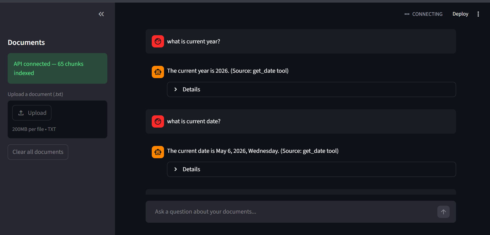

Architecture diagram in ASCII (RAG + Agent + API + UI)

User uploads a document
    ↓
DocuAgent ingests it into ChromaDB
    ↓
User asks questions
    ↓
Agent decides: search documents OR use a tool OR answer directly
    ↓
Streams answer back with sources cited

Streamlit UI
