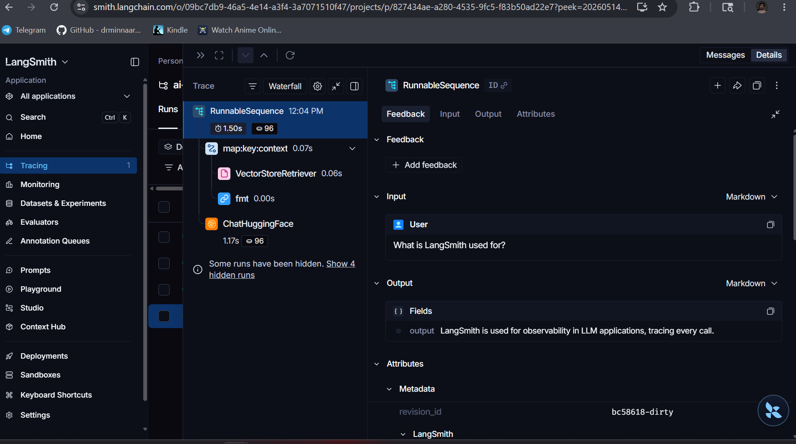

=================================================================
LLM OBSERVABILITY DASHBOARD
Generated: 2026-05-14 12:08:19
=================================================================

OVERALL
  Total calls:         3
  Total tokens:        381
  Total cost:          $0.000038 USD
  Cost per call avg:   $0.000013 USD
  Avg latency:         1038ms
  Max latency:         1198ms

  Projected monthly cost (at 3 calls/day): $0.0011

COST BY CALL TYPE
  Type              Calls     Tokens         Cost  Avg Latency
  ------------------------------------------------------------
  rag                   1        255 $   0.000025        1198ms
  direct                1         67 $   0.000007        1140ms
  agent                 1         59 $   0.000006         777ms

TOP 5 MOST EXPENSIVE CALLS
  #    Type         Tokens         Cost    Latency  Prompt preview
  ----------------------------------------------------------------------
  1    rag             255 $   0.000025      1198ms  'Human: Answer using ONLY this '
  2    direct           67 $   0.000007      1140ms  'Human: What is LangChain in on'
  3    agent            59 $   0.000006       777ms  'Human: Given these tools: calc'

TOP 5 SLOWEST CALLS
  #    Type          Latency   Tokens  Response preview
  -----------------------------------------------------------------
  1    rag             1198ms      255  'LangGraph is a library for bui'
  2    direct          1140ms       67  'LangChain is a framework that '
  3    agent            777ms       59  'calendar'

COST BY SESSION
  Session           Calls         Cost
  ------------------------------------
  demo_session          3 $   0.000038

TOKEN DISTRIBUTION
  p50 (median):   67 tokens
  p90:            255 tokens
  p99:            255 tokens
  Max:            255 tokens

